# VMware Cloud Foundation (VCF) 9.0.1.0 for SINGLE node

Olá! Este guia é voltado para quem deseja instalar o VMware Cloud Foundation (VCF) 9.0.1.0 totalmente funcional em um único host físico ESX, otimizado para desenvolvimento e uso em laboratório. Trata-se de uma adaptação brasileira inspirada no post do [William Lam](https://williamlam.com/) , porém ajustada à realidade e aos desafios do meu ambiente com hardware Supermicro. Com o lançamento do VCF 9.0.1.0, diversas melhorias passaram a permitir o uso da configuração single node nesse hardware, além de corrigirem alertas do vSAN ESA que anteriormente impediam o progresso do deploy.

VCF SINGLE NODE:

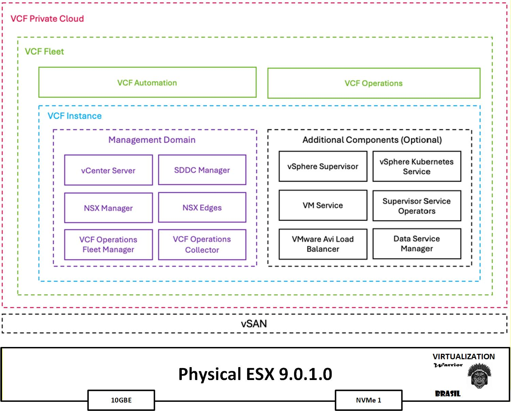

## Tabela de Conteúdos

* [Mudanças](#Mudanças)
* [Lista de Materiais](#Lista-de-Materiais)
* [Requisitos](#Requisitos)
* [Instalação](#Instalação)
* [Blog Referencias](#blog-referencia)

## Mudanças

* **12/11/2025**
  * Release inicial 

## Lista de Materiais

 * [VMware Cloud Foundation (VCF) 9.0.1.0](https://support.broadcom.com/group/ecx/productfiles?subFamily=VMware%20Cloud%20Foundation&displayGroup=VMware%20Cloud%20Foundation%209&release=9.0.1.0&os=&servicePk=&language=EN)
 * [1 x Supermicro SYS-5039C-T Xeon - Apenas GABINETE com FONTE](https://store.supermicro.com/us_en/supermicro-superworkstation-mid-tower-sys-5039c-t.html?srsltid=AfmBOoqg-jlaLt4B4O8Uv6wQlf4fHOl5e4NVb-0EC1cDtYLdxYyO_LkP)
 * [1 Placa-Mãe	Supermicro X10DRL-I](https://www.supermicro.com/en/products/motherboard/X10DRL-i)
 * [2 x Processador Intel Xeon E5-2680 v4 (14 núcleos / 28 threads cada, até 3.3 GHz)](https://www.intel.com.br/content/www/br/pt/products/sku/91754/intel-xeon-processor-e52680-v4-35m-cache-2-40-ghz/specifications.html)
 * [1 x Placa de Rede Dual 10gb Intel Oem X540-t2 Pcie-x8 ou Pcie-x16](https://www.google.com/aclk?sa=L&ai=DChsSEwiqq-Ds3eyQAxUlckgAHbJnCj0YACICCAEQGBoCY2U&co=1&ase=2&gclid=CjwKCAiA_dDIBhB6EiwAvzc1cHgfCS9ga9TKgCAC3GL8IOqj4OBEavBsqMWyz9PIFBD7r76fywEhnhoCnlQQAvD_BwE&cid=CAASsAHkaF74vdaNMVBrabSuvLpDFsoxxg01uQ0JxwBSTJ8HQf6iUy4FqAiRHVliTOfsQTxrLYKIiY0POIrasS_QLdZMJW1Nl9KdCsHaob6ibMi9-EYdvO0sW9j8rJ970NQSJC4RZXQvZwcv9POhKEwr5KbZQw0_NPvxxVMip3GbsX6NCqc08Fsd0qYSAkBAZvSironqGLNbVL4a4hEuinwPJP3DK8BSqcK7TYuS5DETFdv_6A&cce=2&category=acrcp_v1_32&sig=AOD64_10iMXVps5IYMg-aotW5vefmencmA&ctype=5&q=&nis=4&ved=2ahUKEwjt3dbs3eyQAxWoQ7gEHUxMCrkQ9aACKAB6BAgKECQ&adurl=)
 * 6 x Samsung 64GB Kit (6x64GB) DDR4 ECC Registrada
 * [1 x Pen Drive Twist 16GB for booting ESXi Installation](https://a.co/d/9miVjsR)
 * 1 x Kingston SKC600/256G 256GB preto para Instalação Local do ESX VMFS datastore
 * [1 x SSD M.2 2280 512GB PCIe Gen 3x4 NVMe Hikvision](https://a.co/d/01hBflu) para NVMe Tiering
 * [1 x WD_BLACK, SSD SN850x 2TB NVMe M.2 2280](https://a.co/d/8euZAtv) para vSAN ESA
 * [1 x MikroTik CRS304-4XG-IN](https://amzn.to/44J1rt4) para rede sdn NSX-T e demais

## Requisitos

* Minimum 5 VLANs (30, 40, 50, 60, 70) para VCF Fleet Deployment
* MTU 9000

| VLAN       | Role                | IP Address  | Network                                 |
|------------|---------------------|-------------|------------------------------------------|
| 30         | management                          | 192.168.79.254/24  | 192.168.79.0                        |
| 40         | vmotion                             | 10.10.40.1/24      | 10.10.40.0                          |
| 50         | vsan                                | 10.10.50.1/24      | 10.10.50.0                          |
| 60         | ESX/NSX Edge TEP (overlay NSX)      | 10.10.60.1/24      | 10.10.60.0                          |
| 70         | Tier 0 Uplink                       | 10.10.70.1/24      | 10.10.70.0                          |
| 80         | Kubernets (cluster K8s bare-metal)  | 10.10.80.1/24      | 10.10.80.0                          |

* Aqui estão os endereços IP/entradas DNS que você precisará para a configuração inicial (NSX Edge, Supervisor e VKS).

| Hostname   | FQDN                | IP Address  | Function                                 |
|------------|---------------------|-------------|------------------------------------------|
| AD2019     | ad2019.virtualizandoaju.com.br      | 192.168.79.2  | DNS Server                               |
| esx01      | esx01.virtualizandoaju.com.br       | 192.168.79.110| Physical ESX-1 Server                    |
| sddcm01    | sddcm01.virtualizandoaju.com.br     | 192.168.79.12 | VCF Installer / SDDC Manager             |
| vc01       | vc01.virtualizandoaju.com.br        | 192.168.79.13 | vCenter Server for Management Domain     |
| vcf01      | vcf01.virtualizandoaju.com.br       | 192.168.79.14 | VCF Operations                           |
| nsx01      | nsx01.virtualizandoaju.com.br       | 192.168.79.15 | NSX Manager VIP for Management Domain    |
| nsx01a     | mgmt-nsx01a.virtualizandoaju.com.br | 192.168.79.16 | NSX Manager for Management Domain        |
| edge01a    | edge01a.virtualizandoaju.com.br     | 192.168.79.17 | NSX Edge 1a for Management Domain        |
| edge01b    | edge01b.virtualizandoaju.com.br     | 192.168.79.18 | NSX Edge 1b for Management Domain        |
| opsfm01    | opsfm01.virtualizandoaju.com.br     | 192.168.79.19 | VCF Operations Fleet Manager             |
| opsproxy01 | opsproxy01.virtualizandoaju.com.br  | 192.168.79.20 | VCF Operations Proxy Collector           |
| auto01     | auto01.virtualizandoaju.com.br      | 192.168.79.30 | VCF Automation                           |

## Instalação

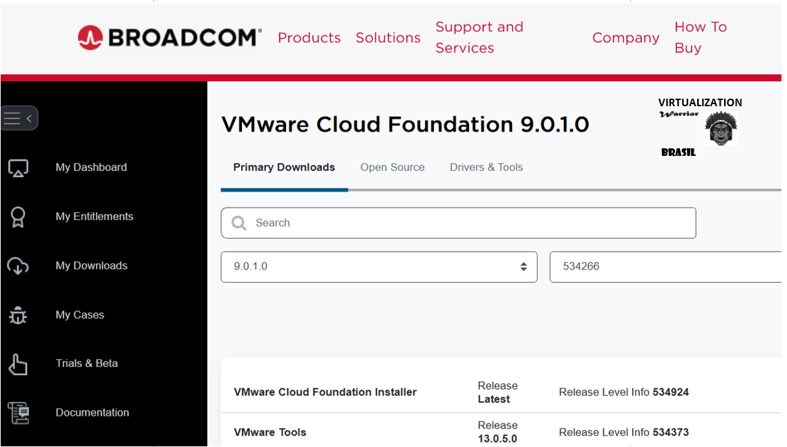

0. Após baixar os metadados/binários necessários no site da Broadcom [VMware Cloud Foundation 9.0.1.0](https://support.broadcom.com/group/ecx/productfiles?subFamily=VMware%20Cloud%20Foundation&displayGroup=VMware%20Cloud%20Foundation%209&release=9.0.1.0&os=&servicePk=534266&language=EN), você deverá ter uma estrutura de diretórios semelhante à seguinte:

```
 PROD
    ├── COMP
    │   ├── ESX_HOST
    │   │   └── VMware-VMvisor-Installer-9.0.1.0.24957456.x86_64.iso
    │   ├── NSX_T_MANAGER
    │   │   ├── VMware-NSX-T-9.0.1.0.24952114.vlcp
    │   │   └── nsx-unified-appliance-9.0.1.0.24952114.ova
    │   ├── SDDC_MANAGER_VCF
    │   │   ├── Compatibility
    │   │   │   └── VmwareCompatibilityData.json
    │   │   └── VCF-SDDC-Manager-Appliance-9.0.1.0.24962180.ova
    │   ├── VCENTER
    │   │   └── VMware-VCSA-all-9.0.1.0.24957454.iso
    │   ├── VCF_OPS_CLOUD_PROXY
    │   │   └── Operations-Cloud-Proxy-9.0.1.0.24960349.ova
    │   ├── VRA
    │   │   └── vmsp-vcfa-combined-9.0.1.0.24965341.tar
    │   ├── VROPS
    │   │   └── Operations-Appliance-9.0.1.0.24960351.ova
    │   └── VRSLCM
    │       └── VCF-OPS-Lifecycle-Manager-Appliance-9.0.1.0.24960371.ova
    ├── metadata
    │   ├── manifest
    │   │   └── v1
    │   │       └── vcfManifest.json
    │   └── productVersionCatalog
    │       └── v1
    │           ├── productVersionCatalog.json
    │           └── productVersionCatalog.sig
    └── vsan
        └── hcl
            ├── all.json
            └── lastupdatedtime.json

19 diretórios, 15 arquivos.
```

Você pode hospedar o VCF Offline Depot usando um servidor web HTTP tradicional (Vamos desativar o HTTPS no VMware Cloud Foundation Installer).Como alternativa, você pode simplesmente usar Python para disponibilizar o diretório (veja esta postagem no blog [Virtualization WARRIOR](https://virtualizandoaju.com/2025/10/29/vcf-9-parte-2-configurando-depot-offline)).

1. Baixe o arquivo python [http_server_auth](config/http_server_auth) e execute em um servidor separado na rede vlan 30 ou outro servidor da sua preferência.

Comando:
python http_server_auth.py --bind 192.168.79.149 --user vcf --password P@ssw0rdP@ssw0rd --directory depot

Certifique-se que o diretório depot exista e esteja de acordo com o passo 0.

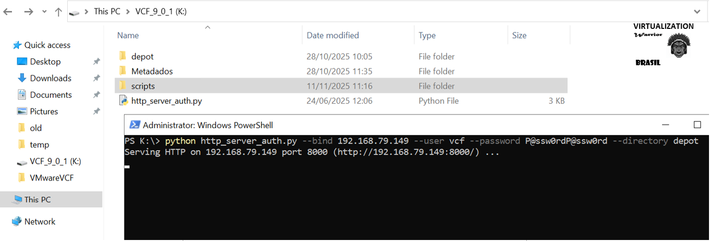

2. Criando um instalador bootavel do ESXi ISO (VMware-VMvisor-Installer-9.0.1.0.24957456.x86_64.iso) usando uma ferramenta ridicula de simples, no entanto, bastante eficiente [UNetbootin](https://unetbootin.github.io/)

3. Com a iso pronta, realizaremos uma instalação automatizada do ESX (também conhecida como ESXi Kickstart) para eliminar o número de etapas manuais que seriam necessárias após a instalação do ESX.

4. Edite o [KS.CFG](config/KS.CFG) e substitua os valores pelas suas configurações desejadas.

Após criar o instalador inicializável do ESX no seu dispositivo USB, copie o arquivo [KS.cfg](config/KS.cfg) modificado para o diretório raiz do dispositivo USB.

Agora, acesse o dispositivo USB em `EFI/BOOT`, edite o arquivo `BOOT.CFG` e atualize o parâmetro `kernelopt` para que corresponda ao seguinte, o que executará o nosso arquivo KS.CFG em vez da instalação interativa:

```code
bootstate=0
title=Loading ESXi installer
timeout=5
prefix=
kernel=/b.b00
kernelopt=ks=usb:/KS.CFG
modules=/jumpstrt.gz --- /useropts.gz --- /features.gz --- /k.b00 --- /uc_intel.b00 --- /uc_amd.b00 --- /uc_hygon.b00 --- /procfs.b00 --- /vmx.v00 --- /vim.v00 --- /tpm.v00 --- /sb.v00 --- /s.v00 --- /atlantic.v00 --- /bcm_mpi3.v00 --- /bnxtnet.v00 --- /bnxtroce.v00 --- /brcmfcoe.v00 --- /cndi_igc.v00 --- /dwi2c.v00 --- /elxiscsi.v00 --- /elxnet.v00 --- /i40en.v00 --- /iavmd.v00 --- /icen.v00 --- /igbn.v00 --- /intelgpi.v00 --- /ionic_cl.v00 --- /ionic_en.v00 --- /irdman.v00 --- /iser.v00 --- /ixgben.v00 --- /lpfc.v00 --- /lpnic.v00 --- /lsi_mr3.v00 --- /lsi_msgp.v00 --- /lsi_msgp.v01 --- /lsi_msgp.v02 --- /mtip32xx.v00 --- /ne1000.v00 --- /nenic.v00 --- /nfnic.v00 --- /nhpsa.v00 --- /nipmi.v00 --- /nmlx5_cc.v00 --- /nmlx5_co.v00 --- /nmlx5_rd.v00 --- /ntg3.v00 --- /nvme_pci.v00 --- /nvmerdma.v00 --- /nvmetcp.v00 --- /nvmxnet3.v00 --- /nvmxnet3.v01 --- /pvscsi.v00 --- /qcnic.v00 --- /qedentv.v00 --- /qedrntv.v00 --- /qfle3.v00 --- /qfle3f.v00 --- /qfle3i.v00 --- /qflge.v00 --- /rdmahl.v00 --- /rshim_ne.v00 --- /rshim.v00 --- /rste.v00 --- /sfvmk.v00 --- /smartpqi.v00 --- /vmkata.v00 --- /vmksdhci.v00 --- /vmkusb.v00 --- /vmw_ahci.v00 --- /bmcal.v00 --- /clusters.v00 --- /crx.v00 --- /drivervm.v00 --- /elx_esx_.v00 --- /btldr.v00 --- /dvfilter.v00 --- /esx_ui.v00 --- /esxupdt.v00 --- /tpmesxup.v00 --- /weaselin.v00 --- /esxio_co.v00 --- /infravis.v00 --- /loadesx.v00 --- /lsuv2_hp.v00 --- /lsuv2_in.v00 --- /lsuv2_ls.v00 --- /lsuv2_nv.v00 --- /lsuv2_oe.v00 --- /lsuv2_oe.v01 --- /lsuv2_sm.v00 --- /native_m.v00 --- /qlnative.v00 --- /trx.v00 --- /vcls_pod.v00 --- /vdfs.v00 --- /vds_vsip.v00 --- /vmware_e.v00 --- /hbrsrv.v00 --- /vsan.v00 --- /vsanheal.v00 --- /vsanmgmt.v00 --- /tools.t00 --- /xorg.v00 --- /gc.v00 --- /imgdb.tgz --- /basemisc.tgz --- /resvibs.tgz --- /esxiodpt.tgz --- /imgpayld.tgz
build=8.0.3-0.35.24280767
updated=0
```

5. Conecte o dispositivo USB ao seu servidor e ligue-o para iniciar a instalação do ESX. Se estiver realizando uma instalação automatizada, você poderá ver este aviso. Ignore-o e aguarde ou pressione Enter para continuar com a instalação.

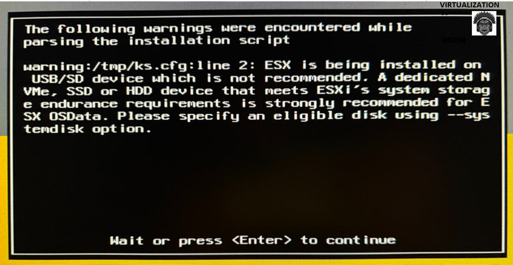

6. Após a reinicialização do ESX (há uma reinicialização secundária como parte da instalação automatizada do ESX), você deverá conseguir acessar o host ESX usando o FQDN e ver algo semelhante a isto:

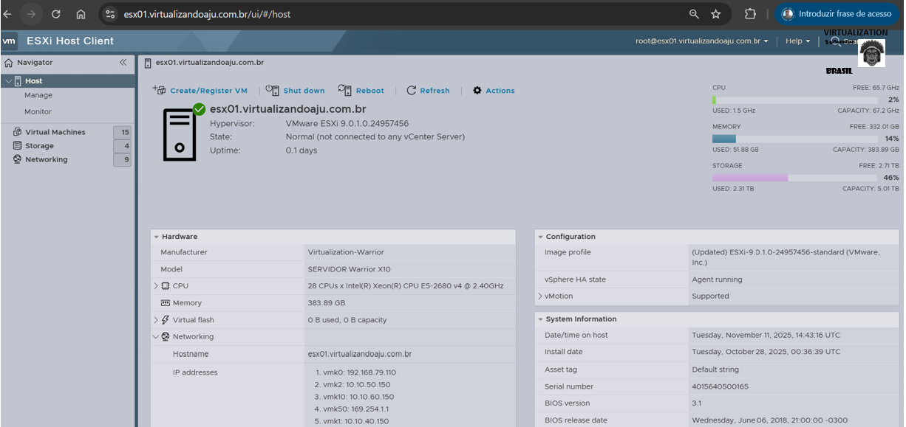

7. (Opcional) Se você estiver usando um servidor DNS windows assim como eu, você pode criar todos os endereços dns usando o script powershell [config_dns_host_a_ptbr.ps1](config/config_dns_host_a_ptbr.ps1).

8. Implante o VCF Installer appliance (VCF-SDDC-Manager-Appliance-9.0.1.0.24962180.ova) usando os passos descritos no blog [virtualization-warrior](https://virtualizandoaju.com/2025/10/29/vcf-installer-9-0-1-0-deployment/).

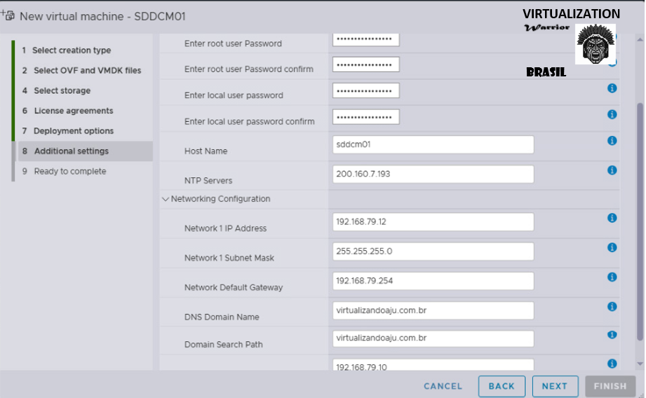

10. Antes de podermos implantar nosso ambiente VCF 9, precisamos preparar a instancia do VCF instalada em (e.g. https://sddcm01.virtualizandoaju.com.br/), sigas os passos a seguir:


```console

# Acesse a console da VM e ative o acesso ssh para o usuário root
vi /etc/ssh/sshd_config

Na lnha:
PermitRootLogin yes

# Na sequencia, execute:
systemctl restart sshd

# Acesso SSH com usuário root daqui em diante.

# Acesse o servidor VCF "sddcm01" e edite o arquivo:
vi /opt/vmware/vcf/lcm/lcm-app/conf/application-prod.properties

# Crie a entrada no final 'do' arquivo: 

#depot offline
lcm.depot.adapter.httpsEnabled=false

# Restart service
systemctl restart lcm

# Habilite o uso de apenas um host ainda logado no servidor VCF "sddcm01":
echo "feature.vcf.internal.single.host.domain=true" >> /home/vcf/feature.properties

# Execute os comandos a seguir no servidor VCF "sddcm01"

chmod 755 /home/vcf/feature.properties
echo "feature.vcf.internal.single.host.domain=true" >> /home/vcf/feature.properties
echo "feature.vcf.vgl-43370.vsan.esa.sddc.managed.disk.claim=true" >> /home/vcf/feature.properties

# Edite o arquivo 'VCFDomainManagerProperties' no servidor VCF "sddcm01".

vi /etc/vmware/vcf/domainmanager/application.properties
enable.speed.of.physical.nics.validation=false
vsan.esa.sddc.managed.disk.claim=true

# Restart services
echo 'y' | /opt/vmware/vcf/operationsmanager/scripts/cli/sddcmanager_restart_services.sh

```

10. Depois de concluída a etapa 9, precisaremos nos conectar ao nosso repositório offline do VCF que você configurou na Etapa 1.

Abra o navegador para acessar o instalador do VCF. (e.g. https://sddcm01.virtualizandoaju.com.br/) e faça login com nome de usuário `admin@local` e a senha que você configurou na Etapa 8 e, em seguida, clique em no botão `DEPOT SETTINGS AND BINARY MANAGEMENT`.

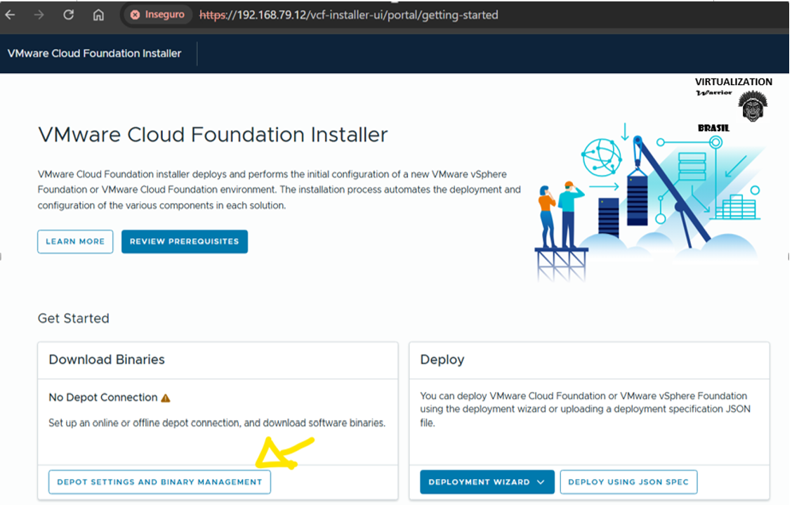

Conecte-se ao seu repositório offline VCF e ele deverá aparecer como ativo se tudo estiver configurado corretamente.


Após extrair os metadados do VCF do seu repositório offline de VCF, clique no botão "DOWNLOAD" para iniciar o download dos binários VCF necessários e certifique-se de que o status de "Sucesso" esteja exibido para cada item listado na tabela.

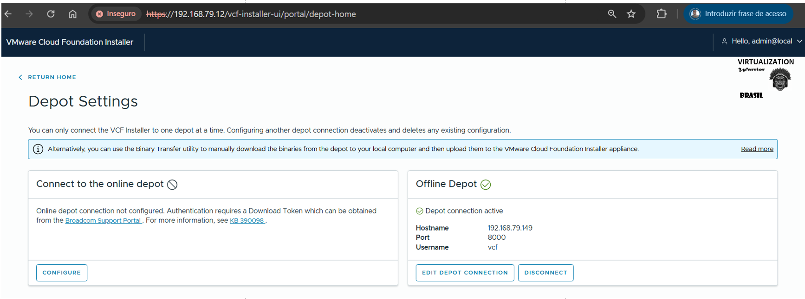
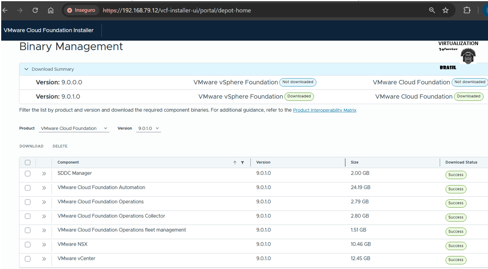

11. Volte para a página inicial do instalador VCF e clique em `DEPLOY USING JSON SPEC` para iniciar a implantação do VCF.

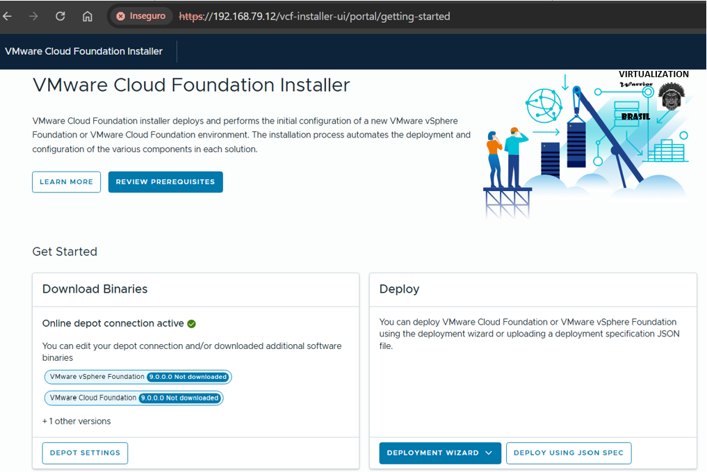

Faça o upload do seu manifesto de implantação VCF modificado. [vcf9010-single-node.json](config/vcf9010-single-node.json) e clique em `Next` para iniciar a validação.

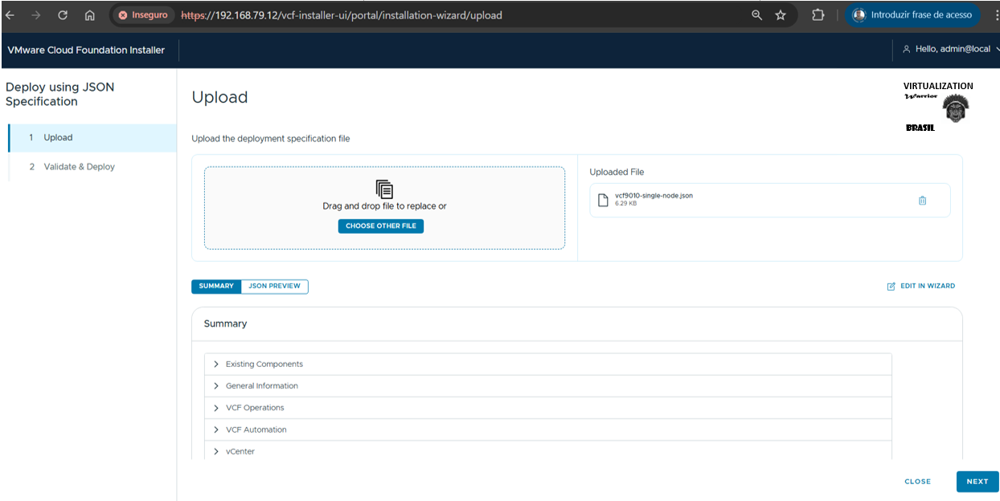

`Next`

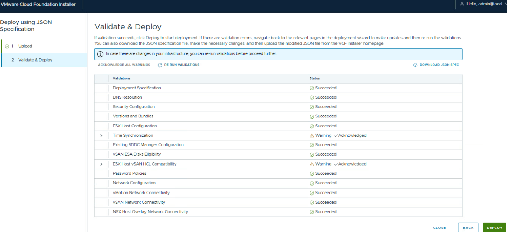

Atenção nesta parte!
Não tenho o print dessa verificação completa porque a instalação do VCF 9.0.1.0 foi feita no dia 28/10 e acabei não salvando essa etapa. As telas que você verá agora foram capturadas em cima de um host ESXi já configurado, por isso alguns erros de validação aparecendo.

Em uma primeira instalação, seguindo corretamente o passo a passo, essas validações devem ser concluídas sem erros (desde que todos os pré-requisitos tenham sido atendidos).

Depois de corrigir e/ou confirmar todas as verificações prévias aplicáveis, clique em `Deploy` para iniciar a implantação.

12. Com apenas um host físico ESXi na sua configuração do VCF 9, você perceberá que, após a implantação do vCenter Server Appliance (VCSA), a instalação falha porque não é possível aplicar a política de armazenamento padrão do vSAN ESA. A solução, porém, é simples: basta acessar o vCenter Server e atualizar a política de armazenamento.

Em vez de simplesmente aguardar essa falha acontecer, utilizo o script criado pelo [William Lam](https://williamlam.com/) — um script PowerCLI que espera o vCenter Server inicializar e, assim que a política de armazenamento do vSAN ESA é criada, atualiza automaticamente essa política para você.

```console
./fix_vsan_esa_default_storage_policy.ps1
```


O script aguardará até que o vCenter Server esteja disponível e, assim que a política de armazenamento vSAN estiver disponível, ele a atualizará automaticamente, evitando, assim, a falha esperada no instalador do VCF, que exigiria uma correção manual e a reinicialização da implantação.

13. A implantação levará algumas horas e, assim que tudo estiver concluído, você deverá ver uma página de sucesso semelhante à seguinte:

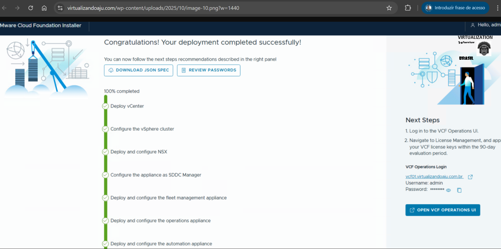

Abra o navegador para acessar o management domain que tem o vcenter do VCF. (https://sddcm01.virtualizandoaju.com.br/) e faça login com nome de usuário `admin@local` e a senha `VMware1!VMware1!`.

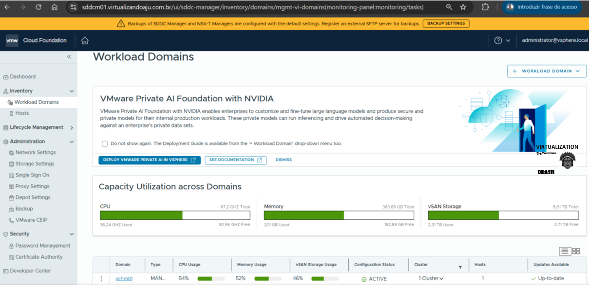

14. Abra o navegador para acessar o vCenter do VCF. (https://vc01.virtualizandoaju.com.br/) e faça login com nome de usuário `administrator@vsphere.local` e a senha `VMware1!VMware1!`.


## Blog Referencia

* [VCF 9 – Parte 1: VCF Installer 9.0.1.0 Deployment](https://virtualizandoaju.com/2025/10/29/vcf-installer-9-0-1-0-deployment/)
* [VCF 9 – Parte 2: Configurando Depot Offline](https://virtualizandoaju.com/2025/10/29/vcf-9-parte-2-configurando-depot-offline/)
* [VCF 9 – Parte 3: Deploy VMware Cloud Foundation 9.0.1.0 – Single Node](https://virtualizandoaju.com/2025/11/12/vcf-9-parte-3-deploy-vmware-cloud-foundation-9-0-1-0-single-node/)
